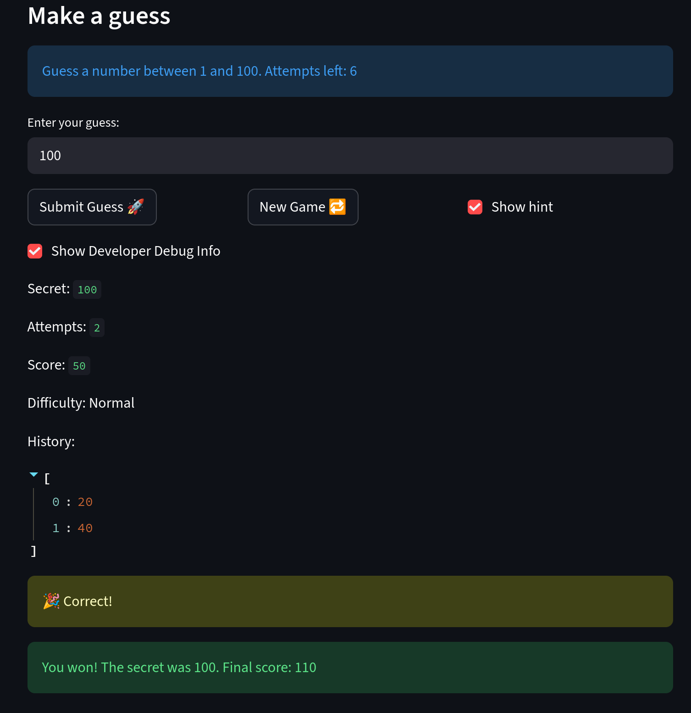
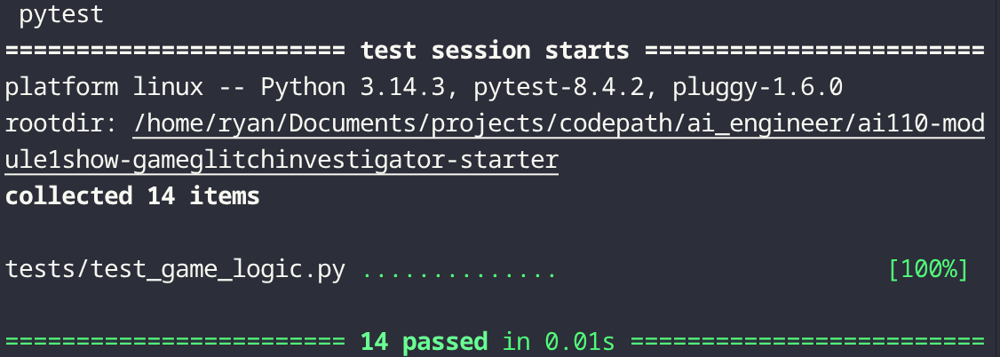
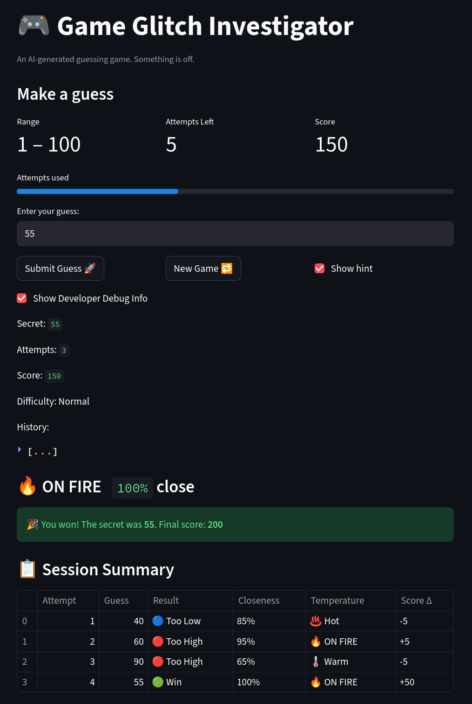

# 🎮 Game Glitch Investigator: The Impossible Guesser

## 🚨 The Situation

You asked an AI to build a simple "Number Guessing Game" using Streamlit.
It wrote the code, ran away, and now the game is unplayable. 

- You can't win.
- The hints lie to you.
- The secret number seems to have commitment issues.

## 🛠️ Setup

1. Install dependencies: `pip install -r requirements.txt`
2. Run the broken app: `python -m streamlit run app.py`

## 🕵️‍♂️ Your Mission

1. **Play the game.** Open the "Developer Debug Info" tab in the app to see the secret number. Try to win.
2. **Find the State Bug.** Why does the secret number change every time you click "Submit"? Ask ChatGPT: *"How do I keep a variable from resetting in Streamlit when I click a button?"*
3. **Fix the Logic.** The hints ("Higher/Lower") are wrong. Fix them.
4. **Refactor & Test.** - Move the logic into `logic_utils.py`.
   - Run `pytest` in your terminal.
   - Keep fixing until all tests pass!

## 📝 Document Your Experience

- [X] Describe the game's purpose.
   - To guess the correct number and score the as many points as possible. 
- [X] Detail which bugs you found.
   - Attempts wouldn't increment and started a 0
   - No error/hint handling for numbers out of range or hint were incorrect
   - Buttons freeze when pressing new game
   - Different attempts for difficulty
- [X] Explain what fixes you applied.
   - Start attempts at 0
   - Buttons don't freeze anymore, so now I can start new games without restarting the app.
   - Difficulty has different attempts but I easy should have the most attempts, not normal, which I didn't fix yet.
   - Shows error when <0 or  >100.  

## 📸 Demo

Challenge 2:
- Claude added the get_guess_closeness at the end of logic_utils.py .
- Updated import and inserted sidebar history block after the attempts caption.
- Updated import and added 5 new tests for get_guess_closeness
- The sidebar displays colored emojis where green is win, red is too high, and blue is too low and there's also a progress bar that shows the different between the secret and the current guessed number.

Challenge 3:
- PEP 8 fixes:                                                       
   - Removed extra spaces in 1    , 100 (line 6)
   - Added space after # in #FIX: comments                            
   - Removed trailing whitespace
   - Added type annotations to check_guess and parse_guess return     
   types                                                              
   - Removed stale dev-note comments (# FIXME, # FIX:)

- Documentation:
   - Added a module-level docstring explaining the file's purpose and
   design philosophy
   - Expanded all docstrings to Google style with Args: and Returns:
   sections
   - Documented the scoring rules inline in update_score's docstring
   - Clarified decimal truncation behavior in parse_guess

## 🚀 Stretch Features

